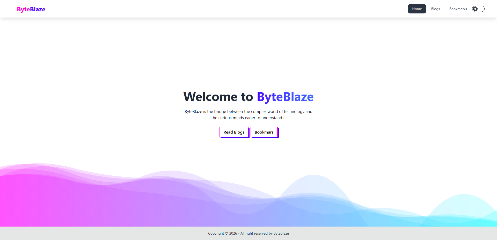
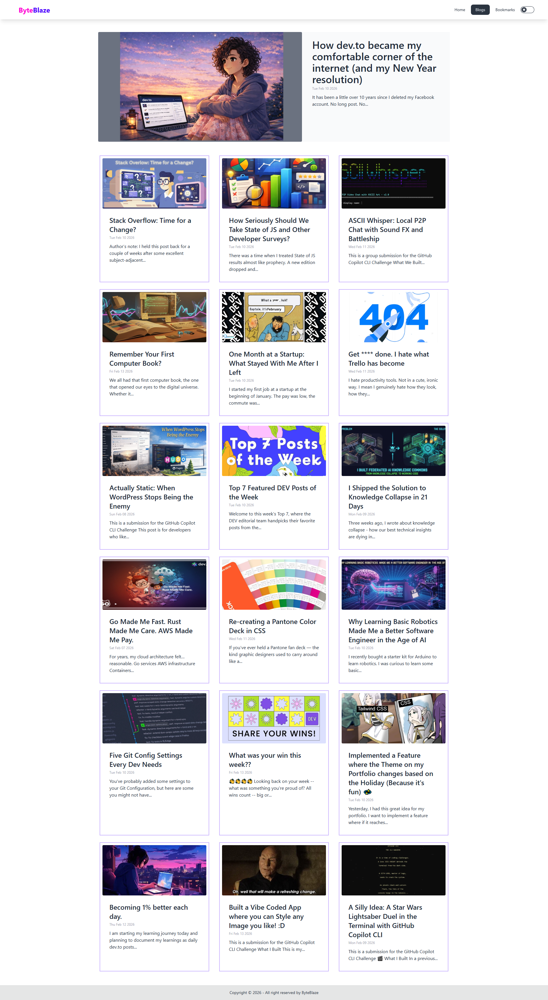

## 🚀 ByteBlaze – Developer Blog Platform

ByteBlaze is a modern and responsive blog platform where users can explore and read developer blogs fetched from the Dev.to API. The project focuses on clean UI, smooth navigation, and an engaging reading experience using modern React tools and Tailwind-based components.

With dynamic routing, markdown rendering, and interactive UI elements, ByteBlaze provides a simple yet powerful way to browse developer content.

# ✨ Features

📚 Browse and read blogs from the Dev.to API

⚡ Fast navigation using React Router

🎨 Modern UI built with TailwindCSS, DaisyUI, and Mamba UI

📝 Markdown blog rendering with React-Markdown

🔔 Toast notifications for user feedback

⏳ Loading spinners for better UX

🔖 Bookmark support for saving blogs

📱 Fully responsive design

Live site:

- [ByteBlaze](https://shimmering-tiramisu-feacc4.netlify.app/)

Resources:

- [React Router Dom](https://reactrouter.com/en/main)
- [Tailwindcss Buttons](https://devdojo.com/tailwindcss/buttons)
- [Mamba UI - Components](https://mambaui.com/components)
- [Animated Gradient Text](https://www.andrealves.dev/blog/how-to-make-an-animated-gradient-text-with-tailwindcss/)
- [Dev.to API Docs](https://developers.forem.com/api/v1#tag/articles/operation/getArticles)
- [React-Hot-Toast](https://react-hot-toast.com/)
- [React-Spinner](https://www.npmjs.com/package/react-spinners)
- [React-Icons](https://react-icons.github.io/react-icons/)
- [React-Markdown](https://www.npmjs.com/package/react-markdown)
- [ReHype-Raw](https://www.npmjs.com/package/rehype-raw)
- [Prop-Types](https://www.npmjs.com/package/prop-types)
- [Daisy UI](https://daisyui.com/)
- [TailwindCSS](https://tailwindcss.com/)

